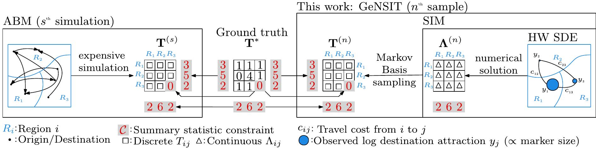

# GeNSIT: Generating Neural Spatial Interaction Tables


[](http://badges.mit-license.org) 

## Video explainer
[](https://www.youtube.com/watch?v=Rv9sNkG5N-0)
<iframe width="560" height="315" src="https://www.youtube.com/embed/Rv9sNkG5N-0" frameborder="0" allowfullscreen></iframe>


- [GeNSIT: Generating Neural Spatial Interaction Tables](#gensit-generating-neural-spatial-interaction-tables)
- [Introduction](#introduction)
  - [Motivation](#motivation)
  - [Contribution](#contribution)
  - [Related publications](#related-publications)
- [Installation](#installation)
  - [Docker](#docker)
  - [OSX](#osx)
  - [Validate installation](#validate-installation)
- [Inputs](#inputs)
  - [Data](#data)
    - [Real-world](#real-world)
    - [Synthetic](#synthetic)
  - [Configs](#configs)
- [Problem setup](#problem-setup)
- [Functionality](#functionality)
  - [Run](#run)
  - [Plot](#plot)
  - [Summarise](#summarise)
  - [Reproduce](#reproduce)
- [Conclusion](#conclusion)
- [Acknowledgments](#acknowledgments)

> **_Quick Start:_** We recommended going through sections on [Installation](#installation) and [Run](#run) if you wish to run `GeNSIT` using default settings.

# Introduction



> **_Tip_** Watch our video explainer [here](https://www.youtube.com/watch?v=Rv9sNkG5N-0)!.

## Motivation

High-resolution complex simulators such as agent-based models (ABMs) are increasingly deployed to assist policymaking in transportation , social sciences, and epidemiology. They simulate individual agent interactions governed by stochastic dynamic systems, giving rise to an aggregate, in a mean field sense, continuous emergent structure. This is achieved by computationally expensive forward simulations, which hinders ABM parameter calibration and large-scale testing of multiple policy scenarios. Considering ABMs for the COVID-19 pandemic as an example, the continuous mean field process corresponds to the spatial intensity of the infections which is noisily observed at some spatial aggregation level, while the individual and discrete human contact interactions that give rise to that intensity are at best partially observed or fully latent. In transportation and mobility, running examples in this work, the continuous mean field process corresponds to the spatial intensity of trips arising from unobserved individual agent trips between discrete sets of origin and destination locations. 

The formal object of interest that describes the discrete count of these spatial interactions, e.g. agent trips between locations, is the origin-destination matrix (ODM). It is an $I\times J$ (two-way) contingency table $\mathbf{T}$ with elements $T_{i,j} \in \mathbb{N}$ counting the interactions of two spatial categorical variables $i,j \in \mathbb{N}_{>0}$, see Figure above. It is typically sparse due to infeasible links between origin and destination locations, and partially observed through summary statistics -- such as table row and/or column marginals -- due to privacy concerns, data availability, and data collection costs. Operating at the discrete ODM level and learning this latent contingency table from summary statistics is vital for handling high-resolution spatial constraints and partial observations such as the total number of agents interacting between a pair of locations. It is also necessary for _population synthesis_ in ABMs, which is performed prior to simulation in order to reduce the size of the ABM's parameter space. Moreover, it avoids errors and biases due to ad-hoc discretisation required when working with continuous approximations of the underlying discrete ODM $\mathbf{T}^*$.

## Contribution

This repository introduces a [computational framework named `GeNSIT`](#introduction) see for exploring the constrained discrete origin-destination matrices of agent trip location choices using closed-form or Gibbs Markov Basis sampling. The underlying continuous choice probability or intensity function (unnormalised probability function) is modelled by total and singly constrained **spatial interaction models** (SIMs) or _gravity models_ embedded in the well-known Harris Wilson stochastic differential equations (SDEs). We employ Neural Networks to calibrate the SIM parameters. We include Markov Chain Monte Carlo (MCMC) schemes leveraged to learn the SIM parameters in previous works. For more details on the mathematical aspects of this repository please look at the [Publications section](#related-publications).

## Related publications
Zachos, Ioannis, Theodoros Damoulas, et al. ‘Table Inference for Combinatorial Origin-Destination Choices in Agent-Based Population Synthesis’. Stat, vol. 13, no. 1, 2024, p. e656, https://doi.org/10.1002/sta4.656. 
<a href="./zachos_stat.bib" style="text-decoration: none;" download="./zachos_stat.bib">
    
</a>

Zachos, Ioannis, Mark Girolami, et al. Generating Origin-Destination Matrices in Neural Spatial Interaction Models. no. arXiv:2410.07352, arXiv, Oct. 2024, https://doi.org/10.48550/arXiv.2410.07352. arXiv. 
<a href="./zachos_nips.bib" style="text-decoration: none;" download="./zachos_nips.bib">
    
</a>


[Back to Table of Contents ⬆](#gensit-generating-neural-spatial-interaction-tables)

# Installation

Assuming Python >=3.9.7 and git are installed, clone this repository by running

```
git clone git@github.com:[REPONAME]/GeNSIT.git
```

Once available locally, navigate to the main folder as follows:

```
cd GeNSIT
```

> **_Tip:_** We recommended running `GeNSIT` on a `Docker` container if you do not plan to make any code changes.

## Docker

This section assumes `Docker` has been installed on your machine. Please follow [this guide](https://docs.docker.com/engine/install/) if you wish to install `Docker`.
Build the docker image image

```
docker build -t "gensit" .
```

Once installed, make sure everything is working by running

```
docker run gensit --help
```

## OSX

This section assumes `anaconda` or `miniconda` has been installed on your machine. Please follow [this](https://docs.anaconda.com/free/anaconda/install/index.html) or [this](https://docs.anaconda.com/free/miniconda/miniconda-install/) guide if you wish to install either of them. Then, run:

```
conda create -y -n gensit python=3.9.7
conda activate gensit
conda install -y -c conda-forge --file requirements.txt
conda install -y conda-build
python3 setup.py develop
```

Otherwise, make sure you install the `gensit` command line tool and its dependencies by running

```
pip3 install -e .
```

## Validate installation

You can ensure that the dependencies have been successfully installed by running:

```
gensit --help
```

You should get a print statement like this:

```
Usage: gensit [OPTIONS] COMMAND [ARGS]...

  Command line tool for Generating Neural Spatial Interaction Tables (origin-
  destination matrices)

Options:
  --help  Show this message and exit.

Commands:
  create     Create synthetic data for spatial interaction table and...
  plot       Plot experimental outputs.
  reproduce  Reproduce figures in the paper.
  run        Sample discrete spatial interaction tables...
  summarise  Create tabular summary of metadata, metrics computed for...
```

Throughout the remainder of this readme we illustrate `GeNSIT's` command line tool capabilities assuming that a `docker` container has been installed.

[Back to Table of Contents ⬆](#gensit-generating-neural-spatial-interaction-tables)

# Inputs

Inputs to `GeNSIT` are [**data**](#data) and [**configuration**](#configs) files.

## Data

The minimum data requirements include:

- A set of origin and destination locations between which agents travel.
- A cost matrix $\mathbf{C}$ reflecting inconvenience of travel from any origin to any destination. This can be distance and/or time dependent (e.g. Euclidean distance and/or travel times).
- A measure of destination attractiveness $\mathbf{z}$. This depends on the types of trips agents make e.g. for work trips this would be number of jobs available at each destination.
- The total number of agents/trips $M$. Each agent performs exactly one trip.

Optional datasets may be:

- Origin and/or destination demand.
- Partially observed trips between selected origin-destination pairs.
- Total distance and/or time agents have travelled by origin and/or destination location.
- A transportation network/graph.
- A ground truth agent trip table to validate your model.

### Real-world

We consider agent trips from residence to workplace locations in Cambridge, UK. We use the following datasets from the Census 2011 data provided by the [Office of National Statistics](https://www.ons.gov.uk):

- <a href="../data/inputs/cambridge_work_commuter_lsoas_to_msoas/lsoas_to_msoas.geojson" target="_blank">Lower super output areas (LSOAs), Middle super output areas (MSOAs)</a> as origin, destination locations, respectively.
- <a href="../data/inputs/cambridge_work_commuter_lsoas_to_msoas/cost_matrices/clustered_facilities_sample_20x20_20_01_2023_sample_20x20_clustered_facilities_ripleys_k_500_euclidean_points%_prob_origin_destination_adjusted_normalised_boundary_only_edge_corrected_cost_matrix_max_normalised.txt" target="_blank">Average shortest path in a transportation network</a> between a random sample of 20 residences inside each LSOA and 20 workplaces inside each MSOA as a cost matrix.
- [Number of jobs available at each MSOA](./data/inputs/cambridge_work_commuter_lsoas_to_msoas/destination_attraction_time_series_sum_normalised.txt) as a destination attraction proxy used in the NN's loss function.
- [Total distance travelled to work from each LSOA](./data/inputs/cambridge_work_commuter_lsoas_to_msoas/lsoas_total_distance_to_work.txt) as an input to the NN's loss function.
- [Ground truth agent trip table](./data/inputs/cambridge_work_commuter_lsoas_to_msoas/table_lsoas_to_msoas.txt) a validation dataset. Parts of this table such as origin/destination demand (row/colsums) and a random subset of trips (cells) are also conditioned upon acting as table constraint data.

We note the transportation network as well as the residence and workplace locations were extracted using Arup's [`genet`](https://github.com/arup-group/genet) and [`osmox`](https://github.com/arup-group/osmox), respectively. The geo-referenced map used as an input to these tools was downloaded from [Open Street Maps](https://www.openstreetmap.org/).

### Synthetic

Alternatively, synthetic data may be generated by running commands such as:

```
docker run gensit create ./data/inputs/configs/generic/synthetic_data_generation.toml \
-dim origin 100 -dim destination 30 -dim time 1 \
-sigma 0.0141421356 --synthesis_n_samples 1000 --synthesis_method sde_solver
```

The command above creates synthetic data based on the requirements in [the section above](#data) using `origin` and `destination` aritificial locations (in our case 100 origins, 30 destinations). A cost matrix is randomly generated for every OD pair. Destination attraction data is generated by running the `synthesis_method` for `synthesis_n_samples` steps (in our case by running the Harris Wilson SDE solver for 1000 steps).

You noticed that we load a configuration file named `synthetic_data_generation.toml` to achieve all this. We elaborate on the use of configs in the [next section](#configs).

[Back to Table of Contents ⬆](#gensit-generating-neural-spatial-interaction-tables)

## Configs

Configuration files contain all settings (key-value pairs) required to `run` NN-based or MCMC-based algorithms for learning the discrete origin-destination table and/or underlying continuous SIM parameters. They are stored in a `toml` format.

Each type of algorithm is associated with an `experiment` type . We hereby refer to the process of running one algorirthm for a given set of configuration parameters as `run`ning an `experiment`. Examples of experiments include `SIM_NN`, `SIM_MCMC`, `JointTableSIM_MCMC`, `DisjointTableSIM_NN`, and `JointTableSIM_NN`.

Most configuration keys can be `sweep`ed for each type of `experiment` being run. This means that a range of values over which the experiment will be run can be provided. For example, the `sigma` parameter below

```
[harris_wilson_model.parameters.sigma.sweep]
  default = 0.0141421356
  range = [0.0141421356, 0.1414213562, nan]
```

means that each experiment in the [`experiments`](#experiments) section will run with `sigma` = 0.0141421356 and `sigma` = 0.141421356. A `sweep` is therefore one run of an `experiment` over a unique set of config values. Sweeps can be either _isolated_ or _coupled_. The above example constitutes an isolated sweep. A coupled sweep is shown below:

```
[harris_wilson_model.parameters.sigma.sweep]
  default = 0.0141421356
  range = [0.0141421356, 0.1414213562, nan]
[training.to_learn.sweep]
  default = ['alpha', 'beta']
  range = [['alpha', 'beta'],['alpha', 'beta'],['alpha', 'beta', 'sigma']]
  coupled = true
  target_name = 'sigma'
```

Here `sigma` is coupled with the `to_learn` parameter, meaning the vary together. In this case each experiment will be run for three different sweep settings: (`sigma = 0.0141421356`, `to_learn` = ['alpha','beta']), (`sigma` = 0.1414213562, `to_learn` = ['alpha','beta']), and (`sigma` = nan, `to_learn` = ['alpha','beta','sigma']). We note that more than one sweep keys can be coupled.

> **_Note:_** More information on each key-value pair found in Configs can be found <a href="./configuration_settings.md" target="_blank">here</a>.

[Back to Table of Contents ⬆](#gensit-generating-neural-spatial-interaction-tables)

# Problem setup

Consider $M$ agents that travel from $I$ origins to $J$ destinations to work. Let the expected number of trips (intensity) of agents between origin $i$ and destination $j$ be denoted by $\Lambda\_{ij}$. The residential population in each origin (row sums) is equal to

$$
    \Lambda\_{i+} = \sum\_{j=1}^{J} \Lambda\_{ij},    i=1,\dots,I,
$$

while the working population at each destination (column sums) is

$$
    \Lambda\_{+j} = \sum\_{i=1}^{I} \Lambda\_{ij},     j=1,\dots,J.
$$

We assume that the total origin and destination demand are both conserved:

$$
    M = \Lambda\_{++} = \sum\_{i=1}^{I} \Lambda\_{i+} = \sum\_{j=1}^{J} \Lambda\_{+j}.
$$

The demand for destination zones depends on the destination's attractiveness denoted by $\mathbf{z} = (z_1,\dots, z_J) \in R\_{>0}^{J}$. Let the log-attraction be $\mathbf{x} = \text{log}(\mathbf{z})$. Between two destinations of similar attractiveness, agents are assumed to prefer nearby zones. Therefore, a cost matrix $\mathbf{C} = (c\_{i,j})\_{i,j=1}^{I,J}$ is introduced to reflect travel impedance. The maximum entropy distribution of agent trips subject to the total number of agents being conserved is derived by maximising the Lagrangian

$$
\mathcal{E}(\boldsymbol{\Lambda}) = \sum\_{i=1}^{I}\sum\_{j=1}^J -\Lambda\_{ij}\log(\Lambda\_{ij}) - \zeta \sum\_{i,j}^{I,J} \Lambda\_{ij} + \alpha \sum\_{j}^{J} x_j\Lambda\_{ij}  - \beta \sum\_{i,j}^{I,J} c\_{ij}\Lambda\_{ij},
$$

where $\zeta,\alpha$ and $\beta$ are the Lagrange multipliers. This yields a closed-form expression for the expected flows (intensity) of agents from $i$ to $j$ for the total constrained SIM:

$$
\Lambda\_{ij} = \frac{\Lambda\_{++}\exp(\alpha x_j -\beta c\_{ij})}{\sum\_{k,m} \exp(\alpha x_m-\beta c\_{km})},
$$

where the multipliers $\alpha,\beta$ control the two competing forces of attractiveness and deterrence, respectively, while $\zeta$ bears no physical interpretation. A higher $\alpha$ relative to $\beta$ characterises a preference over destinations with higher job availability, while the contrary indicates a predilection for closer workplaces. If we further assume that origin demand (${\boldsymbol{\Lambda}}\_{.+}$) is also fixed then we get the singly constrained SIM:

$$
\Lambda\_{ij} = \frac{\Lambda\_{i+}\exp(\alpha x_j -\beta c\_{ij})}{\sum\_{k,m} \exp(\alpha x_m-\beta c\_{km})}.
$$

Spatial interaction models are connected to physics models through the destination attractiveness term $\mathbf{z}$, which is governed by the Harris-Wilson system of $J$ coupled ordinary differential equations (ODEs):

$$
\frac{dz_j}{dt} = \epsilon z_j \left( \Lambda\_{+j} - \kappa z_j + \delta  \right) + \sigma z_j \circ B\_{j,t}, \; \mathbf{z}(0) = \mathbf{z}'.
$$

where $\epsilon$ is a responsiveness parameter, $\kappa>0$ is the number of agents competing for one job, $\delta>0$ is the smallest number of jobs a destination can have and $\Lambda\_{+j}(t) - \kappa z_j(t)$ is the net job capacity in destination $j$. A positive net job capacity translates to a higher economic activity (more travellers than jobs) and a boost in local employment, and vice versa. A stochastic version of the Harris Wilson model is the following:

We recommend you look at relevant [publications](#related-publications) for more information on the Harris Wilson model. Our first goal is to learn the parameters $\alpha,\beta$ using either sampling (MCMC) or optimisation (NN) algorithms. To achieve this goal we leverage data $\mathcal{D}$ about either the observed destination attraction (e.g. the number of jobs available at each destination) and/or the total distance/time traveled by agents in their work trips. In general, we can say that our first goal is to learn the distribution of the agent trip intensity $p(\boldsymbol{\Lambda}\vert \mathcal{C},\mathcal{D})$.

We note that the discrete number of agents traveling to work is represented by

$$
T\_{ij} \sim \text{Poisson}(\Lambda\_{ij}).
$$

Although $\mathbf{T}$ and $\boldsymbol{\Lambda}$ look like similar quantities we emphasize that they are distinct. The former is a discrete quantity while the latter is a continuous quantity and many $T\_{ij}$ may be ''plausible'' under a single $\Lambda\_{ij}$. The SIM intensity $\boldsymbol{\Lambda}$ is a mean-field approximation and can be thought of as the expectation (average) of $\mathbf{T}$ across time for all work trips. We can also reason at a probability level by thinking of $0 \leq \Lambda\_{ij}/\Lambda\_{++}\leq 1$ as transition probabilities from an origin $i$ to a destination $j$. Depending on the available summary data (e.g. ${\mathbf{T}}\_{.+}, {\mathbf{T}}\_{+\.}$) we define a set of constraints $\mathcal{C}$. Our second goal is to sample $\mathbf{T}$ subject to these constraints, i.e. sample from $p(\mathbf{T}\vert \mathcal{C},\mathcal{D})$. More information is provided in the papers provided in the [publications](#related-publications) section.

[Back to Table of Contents ⬆](#gensit-generating-neural-spatial-interaction-tables)

# Functionality

The `GeNSIT` package provides functionality for five different operations: [`create`](#synthetic), [`run`](#run), [`plot`](#plot), [`reproduce`](#reproduce), [`summarise`](#summarise).

> ⚠️ **WARNING:** Python tests have not been updated yet!

## Run

This command runs `experiment`s using Markov Chain Monte Carlo and/or Neural Networks based on a `Config` file. For example, we can run joint table and intensity inference using the following command

```
docker run gensit run ./data/inputs/configs/generic/joint_table_sim_inference.toml \
-et JointTableSIM_NN -nw 6 -nt 3
```

This config runs a `JointTableSIM_NN` experiment using 6 number of workers and 3 number of threads per worker. A list of experiments and the types of algorithms they use to learn $\boldsymbol{\Lambda}$, $\mathbf{T}$ is provided below. We note that experiments that use NNs to learn the intensity function parameters tend to be computationally much faster.

| Experiment            | $\mathbf{T}$ | $\boldsymbol{\Lambda}$ |
| --------------------- | :----------: | :--------------------: |
| `SIM_MCMC`            |      -       |          MCMC          |
| `JointTableSIM_MCMC`  |     MCMC     |          MCMC          |
| `SIM_NN`              |      -       |           NN           |
| `DisjointTableSIM_NN` |     MCMC     |           NN           |
| `JointTableSIM_NN`    |     MCMC     |           NN           |

The `run` command can also be programmatically executed using the notebook <a href="../notebooks/Example%201%20-%20Running%20experiments.ipynb" target="_blank">Example 1 - Running experiments</a>.

[Back to Table of Contents ⬆](#gensit-generating-neural-spatial-interaction-tables)

## Plot

Once an experiment has been completed, we can use the following command to plot its data:

```
docker run gensit plot [PLOT_VIEW] [PLOT_TYPE] -x [X_DATA] -y [Y_DATA]
```

where `PLOT_VIEW` defines the type of view the data should be shown. Views can be simple, tabular or spatial. `PLOT_TYPE` can be either line or scatter. The `X_DATA` or `Y_DATA` are provided as names of experiment outputs or their evaluated expressions (see [Config settings](./configuration_settings.md)).

For example, the code below plots the log destination attraction predictions (x-axis) against the observed data (y-axis) for experiments `JointTableSIM_MCMC`,`JointTableSIM_NN`,`NonJointTableSIM_NN`.

```
docker run gensit plot simple scatter \
-y log_destination_attraction_data -x mean_log_destination_attraction_predictions \
-dn cambridge_work_commuter_lsoas_to_msoas/exp1 \
-et JointTableSIM_MCMC -et JointTableSIM_NN -et NonJointTableSIM_NN \
-el np -el xr -el MathUtils \
-e mean_log_destination_attraction_predictions "signed_mean_func(log_destination_attraction,sign,dim=['id']).squeeze('time')" \
-e mean_log_destination_attraction_predictions "log_destination_attraction.mean('id').squeeze('time')" \
-e log_destination_attraction_data "np.log(destination_attraction_ts).squeeze('time')" \
-ea log_destination_attraction -ea sign \
-ea "destination_attraction_ts=outputs.inputs.data.destination_attraction_ts" \
-ea "signed_mean_func=MathUtils.signed_mean" \
-k sigma -k title \
-cs "da.loss_name.isin([str(['dest_attraction_ts_likelihood_loss']),str(['dest_attraction_ts_likelihood_loss', 'table_likelihood_loss'])])" \
-cs "~da.title.isin(['_unconstrained','_total_constrained','_total_intensity_row_table_constrained'])" \
-c title -op 1.0 -mrkr sigma -l title -l sigma -msz 20 \
-ft 'predictions_figure/destination_attraction_predictions_vs_observations' \
-xlab '$\mathbb{E}\left[\mathbf{x}^{(1:N)}\right]$' \
-ylab '$\mathbf{y}$'
```

The `-e`,`-ea`,`-el` arguments define the evaluated expressions, the keyword arguments used as input to these expressions (also evaluated) and the necessary libraries that are used to perform the operations, respectively. The evaluation is performed using Python's `eval` function. The first two types of argument allow for reading input and/or output data directly. For example, `-ea "destination_attraction_ts=outputs.inputs.data.destination_attraction_ts"` loads the input (observed) destination attraction time series data while `-ea log_destination_attraction -ea sign` loads `log_destination_attraction` and `sign` output datasets.

The output data is sliced using the coordinate values specified by the `-cs` arguments. For instance, `-cs "~da.title.isin(['_unconstrained','_total_constrained','_total_intensity_row_table_constrained'])"` only keeps the datasets whose `title` variable is equal to any of the specified values. The `sweep` data are gathered either from the output dataset itself or from the output config file (in this case we elicit `sigma`,`title` `sweep` variables).

The scatter plot is colored by the `title` variable and its markers are determined by the `sigma` variable. Both of these variables are contained in each `sweep` that was run. The exact mappings from say sigma values to marker types are contained in <a href="../gensit/static/plot_variables.py" target="_blank">this file</a>. Each point is labeled by both the `title` and `sigma` values. The resulting figure is shown below.


[Back to Table of Contents ⬆](#gensit-generating-neural-spatial-interaction-tables)

## Summarise

This command summarised the output data and creates a `csv` file with each data summary from every `sweep`. For example, if we wish to compute the Standardised Root Mean Square Error (SRMSE) for `JointTableSIM_NN` we run

```
docker run gensit summarise \
-dn cambridge_work_commuter_lsoas_to_msoas/exp1 \
-et JointTableSIM_NN \
-el np -el MathUtils -el xr \
-e table_srmse "srmse_func(prediction=mean_table,ground_truth=ground_truth)" \
-e intensity_srmse "srmse_func(prediction=mean_intensity,ground_truth=ground_truth)" \
-ea table -ea intensity -ea sign \
-ea "srmse_func=MathUtils.srmse" \
-ea "signed_mean_func=MathUtils.signed_mean" \
-ea "ground_truth=outputs.inputs.data.ground_truth_table" \
-ea "mean_table=table.mean(['id'])" \
-ea "mean_intensity=signed_mean_func(intensity,'intensity','signedmean',dim=['id'])" \
-ea "mean_intensity=intensity.mean(['id'])" \
-cs "da.loss_name.isin([str(['dest_attraction_ts_likelihood_loss']),str(['dest_attraction_ts_likelihood_loss', 'table_likelihood_loss']),str(['table_likelihood_loss'])])" \
-btt 'iter' 10000 90 1000 \
-k sigma -k type -k name -k title -fe SRMSEs -nw 20
```

The arguments are similar to the `plot` command. Here we also use `-btt` refered to as burning, thinning and trimming to slice the `iter` coordinate values based on their index. In this occasion, we discard the first 10000 samples and then only keep every 90th sample. Finally, we trim this data array to 1000 elements. A small part of the summarised table is shown below.

| type             | sigma  | title                                 | name               | proposal        | intensity_srmse | table_srmse |
| ---------------- | ------ | ------------------------------------- | ------------------ | --------------- | --------------- | ----------- |
| JointTableSIM_NN | 0.141  | doubly_20%\_cell_constrained          | TotallyConstrained | degree_higher   | [1.98]          | [0.38]      |
| JointTableSIM_NN | 0.0141 | unconstrained                         | TotallyConstrained | direct_sampling | [29.51]         | [1.73]      |
| JointTableSIM_NN | 0.141  | unconstrained                         | TotallyConstrained | direct_sampling | [29.51]         | [1.73]      |
| JointTableSIM_NN | 0.141  | doubly_constrained                    | TotallyConstrained | degree_higher   | [2.02]          | [0.46]      |
| JointTableSIM_NN | 0.0141 | doubly_10%\_cell_constrained          | TotallyConstrained | degree_higher   | [0.89]          | [0.42]      |
| JointTableSIM_NN | 0.141  | total_intensity_row_table_constrained | TotallyConstrained | direct_sampling | [5.93]          | [2.16]      |
| JointTableSIM_NN | 0.0141 | doubly_20%\_cell_constrained          | TotallyConstrained | degree_higher   | [0.94]          | [0.38]      |
| JointTableSIM_NN | 0.141  | doubly_constrained                    | TotallyConstrained | degree_higher   | [0.68]          | [0.55]      |
| JointTableSIM_NN | 0.141  | unconstrained                         | TotallyConstrained | direct_sampling | [29.51]         | [1.73]      |

Processing experimental outputs for uses similar to the ones provided by `plot` and `summarise` commands can also be achieved by following the steps of notebook <a href="../notebooks/Example%202%20-%20Reading%20outputs.ipynb" target="_blank">Example 2 - Reading outputs</a>.

[Back to Table of Contents ⬆](#gensit-generating-neural-spatial-interaction-tables)

## Reproduce

Finally, this command is run to reproduce the figures appearing in the [papers](#related-publications). The commands are self-explanatory:

```
docker run gensit reproduce figure1;
docker run gensit reproduce figure2;
docker run gensit reproduce figure3;
docker run gensit reproduce figure4;
```

[Back to Table of Contents ⬆](#gensit-generating-neural-spatial-interaction-tables)

# Conclusion

We have introduced `GeNSIT`, an efficient framework for sampling jointly the discrete combinatorial space of agent trips ($\mathbf{T}$) subject to summary statistic data $\mathcal{C}$ and its mean-field $\boldsymbol{\Lambda}$ limit. Therefore, users of this package can perform agent location choice synthesis based on the available data $\mathcal{C},\mathcal{D}$. Although our discussion has been limited to residence to work trips, other types of trips could be modelled too, such as residence to shopping center. The main limitations of this package are the inability to model **activity chains** as opposed to trips and the fact that only static (time-independent) origin destination matrices are considered.

# Acknowledgments

Thank you for visiting our GitHub repository! We're thrilled to have you here. If you find our project useful or interesting, please consider showing your support by starring the repository and forking it to explore its features and contribute to its development. Your support means a lot to us and helps us grow the community around this project. If you have any questions or feedback, feel free to open an issue or reach out to us.

[Back to Table of Contents ⬆](#gensit-generating-neural-spatial-interaction-tables)
