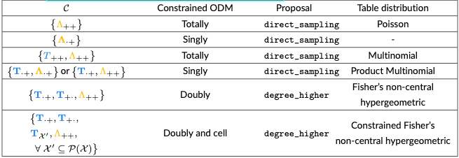

# Configuration settings

Configs consist of nine sections: [`inputs`](#inputs-1), [`contingency table`](#contingency-table), [`spatial interaction model`](#spatial-interaction-model), [`harris wilson model`](#harris-wilson-model), [`training`](#training), [`mcmc`](#mcmc), [`experiments`](experiments), and [`outputs`](#outputs).

There are two additional settings (`log_level` and `sweep_mode`). The former control the level of Python's logging (printing) module while the latter switches sweep mode on/off. If sweep mode is activated any sweeped parameters and the cross produce of their values will be looped over to create `sweeps` with their associated output datasets.

- [Configuration settings](#configuration-settings)
  - [Inputs](#inputs)
    - [Data](#data)
  - [Contingency table](#contingency-table)
  - [Constraints](#constraints)
  - [Spatial interaction model](#spatial-interaction-model)
    - [Parameters](#parameters)
  - [Harris wilson model](#harris-wilson-model)
    - [Parameters](#parameters-1)
  - [Training](#training)
  - [MCMC](#mcmc)
    - [Contingency Table](#contingency-table-1)
    - [Parameters](#parameters-2)
    - [Destination Attraction](#destination-attraction)
  - [Neural network](#neural-network)
  - [Hyperparameters](#hyperparameters)
    - [Loss](#loss)
  - [Experiments](#experiments)
  - [Outputs](#outputs)

## Inputs

The number of workers and number of threads per worker is controlled by `n_workers` and `n_threads`, respectively. The directory from which inputs are read is specified by `in_directory`/`dataset`. The `HOME` directory relative to which this path is created is `/path_to_your_code/GeNSIT/`. The random seed generator can be fixed using `seed`.

The `device` key determines whether `cuda` will be used or not. Its possible values are therefore `cpu` and `cuda`. The `load_experiment` key allows users to load partially run experiments to resume their run.

> **_Warning:_** We recommend users do not make use of the `load_experiment` as it has not been properly tested.

### Data

This section specified files to all input datasets used by all `GeNSIT` commands (not just `run`). The possible datasets are `origin_demand`, `destination_attraction_ts`, `cost_matrix`, `ground_truth_table`, `total_cost_by_origin`. The bare minimum specification contains at least the `cost_matrix` dataset.

[Back to Table of Contents ⬆](#configuration-settings)

## Contingency table

This section specifies constraints on the origin-destination table (equivalent to a two-way contingency table). The summary statistics of this table (also referred to as margins) can be allowed to contain zeros by setting `sparse_margins=true`.

## Constraints

Constraints are either specific on an `axes` or an individual `cell` level. Axes constraints are a list of the table axes that are fixed/conserved/observed. For example, `[0]` means that the table rowsums are fixed.

> **_Warning:_** We distinguish between the cases of `[0,1]` and `[[0],[1]]`. The former corresponds to the grant total of the table being fixed while the latter means that the row-sums and column-sums are both fixed (and hence the table grand total).

Cell constraints contain a pointer to the file with a list of table indices that are conserved e.g. `[[4,6],[21,12]]`. Alternatively, a list of indices can be directly provided instead of the pointer as shown. For this setting to have an effect you need to provided the input `ground_truth_table`.

[Back to Table of Contents ⬆](#configuration-settings)

## Spatial interaction model

This section contains parameters relevant to the Spatial Interaction Model (intensity function). The type of SIM is specified by `name` which takes the values `TotallyConstrained` or `ProductionConstrained`. The `grand_total` parameter defines the total number of agents modelled and is used in the case that no `ground_truth_table` is provided.

### Parameters

These are parameters specific to the SIM (`alpha`,`beta`,`bmax`). The `bmax` parameter is a scaling factor for use in MCMC algorithms. More information about these parameters can be found in [our README file](./README.md#problem-setup). If `alpha` and/or `beta` are learned then the value you specify here corresponds to their initialisations when running the learning algorithm. Otherwise, they correspond to the ''ground truth''.

> **_Tip:_** If you wish to provide your own cost matrix make sure that it normalised by its grand total if you plan to use our MCMC algorithms and by its maximum if you plan to use our NN algorithms.

[Back to Table of Contents ⬆](#configuration-settings)

## Harris wilson model

This section is relevant to the Harris Wilson SDE (physics model) that embeds the SIM. The Euler-Mariyama discretisation step size parameter is denoted by `dt`.

> **_Warning:_** Be wary of your choice of `dt` since this might introduce numerical overflow problems presents in most SDE discretisation schemes.

### Parameters

The HW parameters include `epsilon`,`kappa`,`delta` and `sigma` (SDE noise). More information about these parameters can be found in [our README file](./README.md#problem-setup). An extra parameter used in the `noise_percentage` which is mapped to the variance of the destination attraction data gaussian likelihood/loss by performing $\text{log}(J)$\*`noise_percentage`.

[Back to Table of Contents ⬆](#configuration-settings)

## Training

The training parameters include the total number of iterations/epochs of the learning algorithm `N`. The `num_steps` corresponds to the total number of steps the SDE discretisation scheme is run to generate synthetic data and therefore is only relevant when used with the `create` command. Also, the list of parameters that need to be learned are provided in `to_learn`. Finally, the `batch_size` of the Neural Network (if used) corresponds to the time window length of the destination attraction time series based on which the loss function will be evaluated. In our case we are only modelling the equilibrium (stationary) destination attractions and therefore this value is always equal to 1.

[Back to Table of Contents ⬆](#configuration-settings)

## MCMC

This section contains settings relevant to the MCMC learning algorithm (either at the continuous intensity or the discrete table level). The `disable_tqdm` flag enables/disables progress monitoring in the algorithm while the `mcmc_workers` correspond to the number of workers used in MCMC-specific routines such as the computation of the intractable normalising constant of the Harris Wilson SDE's stationary distribution. The interpretation of the MCMC parameter settings is elaborated in [our README file](./README.md#problem-setup).

> **_Tip:_** We recommend setting `mcmc_workers=1` if either `num_workers` or `num_threads` are set to a value larger than one. Otherwise, you risk running out of cores and your application crushing.

### Contingency Table

The number of table samples obtained for each iteration of the learning algorithm is given by `table_steps` and is usually set to one. The name of the algorithm used to initialise tables is set in `table0`. Available algorithms are `maximum_entropy_solution`, `direct_sampling` and `random_sample`. The second option is only available when the table distribution is available in closed-form. Similarly, table margins are initialised based on `margin0` which can be safely ignored. The table MCMC `proposal` can be one of `direct_sampling`, `degree_one` or `degree_higher`. The first option corresponds to directly sampling from the closed-form table distribution whereas the last two options correspond to the Markov Basis proposal mechanism.

> **_Tips:_**
>
> 1. We recommend setting `table0=maximum_entropy_solution` so that the initialised table is not very sparse to avoid getting ''stuck'' during table MCMC.
> 2. We recommend setting `proposal=degree_higher` if the table is intractable since the MCMC converges faster to the target distribution compared to `degree_one`.

A list of all table distributions and their corresponding constraints govering tractability is provided below:

### Parameters

The number of SIM parameter samples per learning algorithm iteration is equal to `theta_steps`. The MCMC scheme for the parameter updates is a Metropolis Hastings with hyperparameters `step_size` and `covariance` which determines the distance of new $\theta$ samples relative previous ones.

### Destination Attraction

The MCMC scheme for the destination attraction update is Hamiltonian Monte Carlo that is run for `log_destination_attraction_steps` for every iteration of the learning algorithm. Its hyperparameters are `leapfrog_steps` and `leapfrog_step_size`.

The remaining parameters (`ais_leapfrog_steps`,`ais_leapfrog_step_size`,`ais_samples`,`n_bridging_distributions`) are relevant to the sampling of the normalising constant of Harris Wilson SDE's stationary distribution. More guidance on how to set them can be found in the Appendix of [our first publication](./README.md#related-publications).

[Back to Table of Contents ⬆](#configuration-settings)

## Neural network

This section is only relevant if any of the following experiments are run: `SIM_NN`, `NonJointTableSIM_NN`,`JointTableSIM_NN`.

## Hyperparameters

Hyperparameters are relevant to the architecture of the Neural Network. The number of hidden layers (excluding input and output) is given by `num_hidden_layers`. The loss optimisation algorithm is given by `optimizer` and its `learning_rate`. NN layer biases correspond to `biases`. The `layer_specific` number of nodes per layer and activation functions are equal to `nodes_per_layer` and `activation_funcs`, respectively.

### Loss

A loss function is specified by `loss_name`,`loss_function`,`loss_kwargs`. The `loss_name` uniquely identifies the individual loss datasets sumed to compute the loss for a given epoch. The `loss_function` takes as input each dataset in `loss_name` and calculated the loss. The `loss_kwargs` are auxiliary parameters pertinent to the computation of the loss.

[Back to Table of Contents ⬆](#configuration-settings)

## Experiments

This is a list of experiment types and their experiment-specific settings. The experiment `type` can be one of `SIM_NN`, `SIM_MCMC`, `JointTableSIM_MCMC`, `DisjointTableSIM_NN`, and `JointTableSIM_NN`. A `comment` is stored in the output metadata to help the user identify a particular experiment run. The rest of the settings (`disable_tqdm`,`export_samples`,`export_metadata`,`overwrite`,`validate_samples`) are boolean flags and can be safely ignored. In case of interest, if set to true these settings achieve the following:

- `disable_tqdm`: Enables `tqdm` progress monitoring of a given `sweep` run.
- `export_samples`: Exports `sample` data to `h5` format for a given `sweep` run.
- `export_metadata`: Exports `config` metadata to `json` format for a given `sweep` run.
- `overwrite`: Overwrites existing output folder if they exist.
- `validate_samples`: Check the validity (e.g. positivity) of output samples for every algorithm iteration and `sweep` run.

[Back to Table of Contents ⬆](#configuration-settings)

## Outputs

If the size of samples is large enough so that memory problems emerge we use the `chunk_size` parameter to set maximum number of samples held in memory at any point in the computation of our experiments before an sample export is instructed, thus clearing the memory. The `write_start` and `write_every` parameters can be safely ignored. All experimental outputs are stored in `out_directory`/`in_dataset`/`out_group` relative to the `HOME` directory. The outputs `title` is appended to the experiment id and together uniquely identify the folder containing all `sweep` runs of a given `experiment`.

[Back to Table of Contents ⬆](#configuration-settings)
